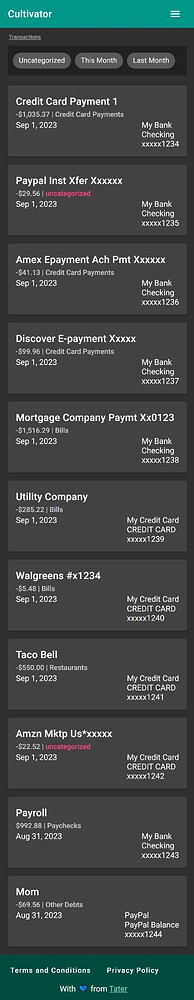
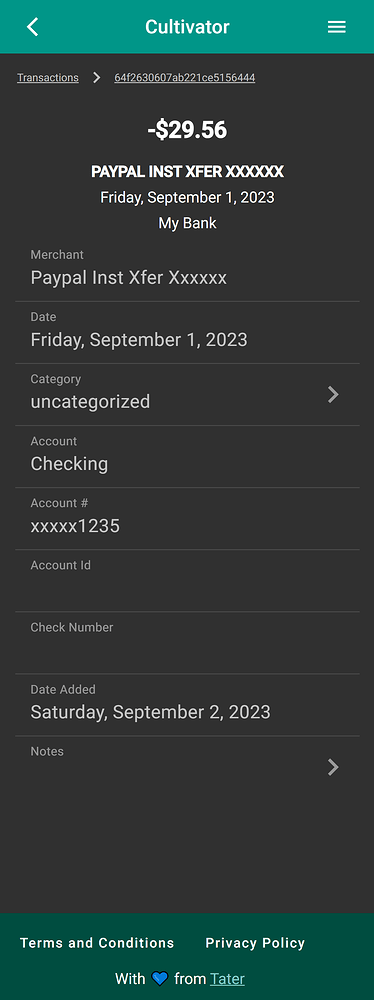
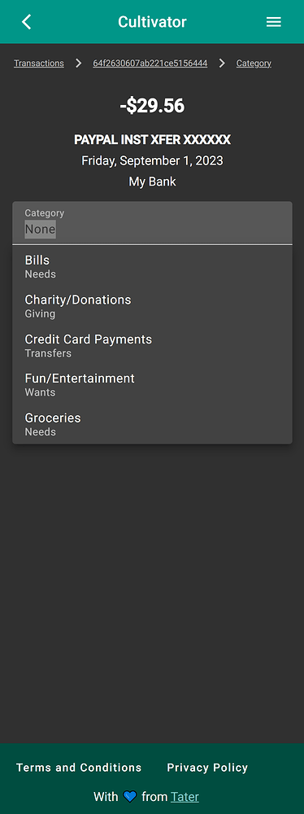

# Cultivator

An Angular-based open-source budget application built to interface seamlessly with Tiller. Manage your finances, view transaction history, and stay on budget with a responsive, easy-to-use interface.

https://cultivator.nathanorick.com/

## Features

- **Google Authentication:** Secure login using your Google Account.
- **Tiller Integration:** Interface with your Tiller spreadsheets for tracking.
- **Budget Monitoring:** Visualize and track your budget quickly and efficiently.
- **Open Source & Extensible:** Modify the dashboard to suit your personal financial needs.





## Getting Started

Follow these instructions to get a copy of the project up and running on your local machine for development and testing purposes.

### Prerequisites

Make sure you have Node.js and NPM installed:
- [Node.js](https://nodejs.org/) (Use the version specified in `.nvmrc`)
- Angular CLI (`npm install -g @angular/cli`)

### Installation

1. **Clone the repository**
   ```bash
   git clone https://github.com/<YOUR_USERNAME>/taters-budget-app-for-tiller.git
   cd taters-budget-app-for-tiller
   ```

2. **Install dependencies**
   ```bash
   npm install
   ```

3. **Set up Environment Variables**
   The application requires a Google Client ID to handle authentication.
   - Copy the example `.env` file:
     ```bash
     cp .env.example .env
     ```
   - Open `.env` and replace `your-google-client-id` with your actual Google Client ID from the Google Cloud Console.

4. **Start the Development Server**
   ```bash
   npm start
   ```
   Navigate to `http://localhost:4200/`. The application will automatically reload if you change any of the source files.

## Running Tests

- **Unit tests:** Run `npm run test` to execute the unit tests via [Karma](https://karma-runner.github.io).
- **Linter:** Run `npm run lint` to check for code style issues.

## Contributing

We welcome contributions! Please see the [CONTRIBUTING.md](CONTRIBUTING.md) file for guidelines on how to open issues, submit pull requests, and our coding standards.

## License

This project is licensed under the GNU General Public License v3.0 - see the [LICENSE](LICENSE) file for details.
